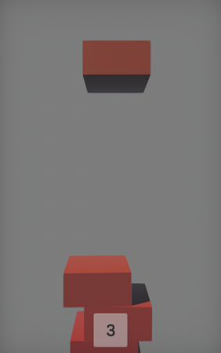

# PILE UP!

## About

PILE UP! is a **hyper casual** game made in **~48h** during [Mini Jam 34: Balance](https://itch.io/jam/mini-jam-34-balance). The main goal is to **stack** the tallest pile. The player can 
**move** the pile left and right, trying to keep it in **balance**. The pieces keep **falling** from the top. The game ends when the pile **falls sideways**.

You can **play in the browser** by clicking [here](https://m-biernat.itch.io/pile-up).

## Tools & Dependencies

 - [Unity 2019.1.11](https://unity.com/releases/editor/whats-new/2019.1.11) - game engine;
 - Various online synthesizers and [Audacity](https://www.audacityteam.org/) to create BGM and SFX.

## Credits

 - **Michał Biernat** @[m-biernat](https://github.com/m-biernat) - game designer, programmer, and a "composer".

## License

All rights reserved ([no license](https://choosealicense.com/no-permission/)): 
 - You **can** view (peek into the code and assets) and fork this repository;
 - You **cannot** reproduce, distribute, or create derivative works;
 - You **can** play the game (*"PILE UP!"*) free of charge via the provided channels.
